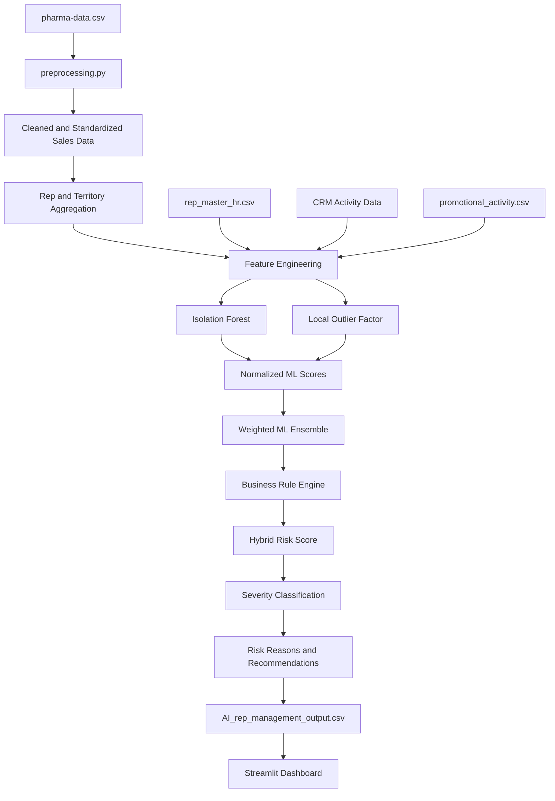

# RepSense AI
## AI-Powered Sales Representative Vacancy Analysis and Territory Risk Management Platform

Presentation-ready project content based on the current implementation and generated datasets.

---

## 1. Executive Summary

RepSense AI is a pharmaceutical sales intelligence platform that analyzes sales territories and combines machine learning anomaly detection with operational business rules.

The platform helps managers answer four questions:

1. Where is a territory or sales operation showing risk?
2. Why was the territory flagged?
3. How serious is the risk?
4. What action should management take?

The system combines:

- Pharmaceutical sales transactions
- Sales representative and staffing information
- CRM activity
- HCP/customer coverage
- Promotional activity
- Machine learning anomaly detection
- Configurable business rules
- Explainable recommendations
- Interactive Streamlit dashboards

Current application URL during local testing:

```text
http://localhost:8501
```

---

## 2. Business Problem

Pharmaceutical sales managers need to monitor many territories, representatives, customers, and products at the same time.

Important warning signals can be difficult to detect manually:

- Declining sales
- Low representative activity
- Insufficient HCP coverage
- Open representative vacancies
- Long vacancy duration
- Unusual territory behavior
- Ineffective or low-impact promotional activity
- Imbalanced staffing across territories

RepSense AI converts these signals into a territory-level risk score and an easy-to-read management recommendation.

---

## 3. Main Input File

Input file: `pharma-data.csv`

Current size:

- Rows: 254,082
- Columns: 18
- Granularity: Individual pharmaceutical sales transactions

Input columns:

```text
Distributor
Customer Name
City
Country
Latitude
Longitude
Channel
Sub-channel
Product Name
Product Class
Quantity
Price
Sales
Month
Year
Name of Sales Rep
Manager
Sales Team
```

### Input Sample

```csv
Distributor,Customer Name,City,Country,Latitude,Longitude,Channel,Sub-channel,Product Name,Product Class,Quantity,Price,Sales,Month,Year,Name of Sales Rep,Manager,Sales Team
Gottlieb-Cruickshank,"Zieme, Doyle and Kunze",Lublin,Poland,51.2333,22.5667,Hospital,Private,Topipizole,Mood Stabilizers,4,368,1472,January,2018,Mary Gerrard,Britanny Bold,Delta
Gottlieb-Cruickshank,Feest PLC,Swiecie,Poland,53.4167,18.4333,Pharmacy,Retail,Choriotrisin,Antibiotics,7,591,4137,January,2018,Jessica Smith,Britanny Bold,Delta
Gottlieb-Cruickshank,Medhurst-Beer Pharmaceutical Limited,Rybnik,Poland,50.0833,18.5,Pharmacy,Institution,Acantaine,Antibiotics,30,66,1980,January,2018,Steve Pepple,Tracy Banks,Bravo
```

Each input row is a transaction involving a distributor, customer, product, representative, territory, and sales amount.

---

## 4. Output File

Main output file: `AI_rep_management_output.csv`

Current generated size:

- Rows: 8
- Columns: 45
- Granularity: Territory and analysis date

The current demo output contains eight territories. The available source data and current processing path produce one effective analysis date, so the generated output is a small demonstration snapshot rather than a full multi-month production history.

### Output Columns

```text
date
territory_id
sales
transactions
quantity
customers
products
active_reps
hcps
previous_month_sales
sales_change_pct
rolling_3m_sales
sales_vs_3m_avg_pct
planned_calls
actual_calls
planned_visits
actual_visits
call_completion_pct
visit_completion_pct
hcp_coverage_pct
avg_activity
avg_hcp_coverage
prev_month_activity
activity_change_pct
current_reps
required_reps
vacancies
avg_promotion_uplift
promotion_count
isolation_forest_score
lof_score
ensemble_anomaly_score
if_anomaly
lof_anomaly
sales_risk_score
crm_risk_score
hcp_coverage_risk_score
vacancy_risk_score
long_vacancy_risk
ml_risk_score
business_risk_score
final_risk_score
severity
risk_reasons
ai_recommendation
```

### Output Sample

```csv
date,territory_id,sales,transactions,quantity,customers,products,active_reps,hcps,sales_change_pct,vacancies,avg_activity,avg_hcp_coverage,ensemble_anomaly_score,final_risk_score,severity,risk_reasons,ai_recommendation
2017-01-01,TERR_01,1550393976.31,32018,3733454.72,94,240,13,94,0.0,0,82.99,1.12,60.0,23.5,Minor,"HCP coverage 1% (below 85%); Isolation Forest detected unusual pattern","Continue routine monitoring. Minor risks detected; no urgent action needed."
2017-01-01,TERR_02,1504139008.51,32252,3720935.21,95,240,13,95,0.0,2,82.67,1.18,40.32,22.61,Minor,"2 rep vacancy/vacancies; HCP coverage 1% (below 85%)","Continue routine monitoring. Minor risks detected; no urgent action needed."
2017-01-01,TERR_03,1602690127.11,32702,3860878.16,95,240,13,95,0.0,2,82.12,1.00,62.40,30.34,Minor,"2 rep vacancy/vacancies; HCP coverage 1% (below 85%)","Continue routine monitoring. Minor risks detected; no urgent action needed."
```

The complete output is available in `AI_rep_management_output.csv`.

---

## 5. Complete Architecture



### Architecture Layers

#### Layer 1: Raw Data

The system reads transaction-level pharmaceutical sales data from `pharma-data.csv`.

#### Layer 2: Data Preparation

`preprocessing.py` cleans text, standardizes column names, removes exact duplicates, converts dates, creates IDs, and handles numeric fields.

#### Layer 3: Synthetic Operational Data

Because the source sales file does not contain complete HR, CRM, or promotional records, reproducible demonstration layers are generated using random seed 42.

#### Layer 4: Feature Engineering

Sales, CRM, HCP, vacancy, and promotional information is joined into a territory-date feature table.

#### Layer 5: Machine Learning

Isolation Forest and Local Outlier Factor independently identify unusual territory patterns.

#### Layer 6: Business Rules

Configurable thresholds translate sales, activity, coverage, and staffing conditions into business risk scores.

#### Layer 7: Hybrid Scoring

Machine learning and business rule scores are combined into a final 0 to 100 risk score.

#### Layer 8: Explainability

The system generates human-readable reasons and management recommendations.

#### Layer 9: User Interface

The Streamlit application presents KPIs, charts, risk tables, territory investigation, representative information, promotions, and a keyword-based assistant.

---

## 6. Implemented Files

### `app.py`

Streamlit user interface containing six pages:

1. Executive Dashboard
2. AI Risk Monitor
3. Territory Deep Dive
4. Rep Management
5. Promotion Analytics
6. AI Assistant

Additional features:

- Cached CSV loading using `st.cache_data`
- Date filtering
- Severity filtering
- Case-insensitive column handling
- Interactive Plotly charts
- Risk tables
- Territory selection
- Management recommendations

### `pipeline.py`

Complete end-to-end processing workflow:

- Loads raw data
- Generates HR, CRM, and promotional layers
- Builds territory and rep summaries
- Engineers analytical features
- Runs anomaly detection
- Computes business risk scores
- Calculates final risk scores
- Generates explanations
- Writes output CSV files

### `preprocessing.py`

Data preparation and aggregation functions:

- `clean_pharma_data`
- `create_monthly_rep_summary`
- `create_monthly_territory_summary`

### `config.py`

Centralized configuration for:

- Sales thresholds
- CRM thresholds
- HCP coverage thresholds
- Vacancy thresholds
- ML model settings
- Risk score weights
- Severity ranges
- Synthetic data seed

### `requirements.txt`

Main packages:

```text
pandas
numpy
scikit-learn
streamlit
plotly
openpyxl
```

### `README.md`

Project documentation covering architecture, assumptions, methodology, installation, limitations, and production recommendations.

### `TESTING_REPORT.md`

Testing and deployment summary.

---

## 7. Data Processing Details

### Column Standardization

Original names are normalized to lowercase underscore format:

```text
Name of Sales Rep -> name_of_sales_rep
Customer Name     -> customer_name
Product Name      -> product_name
Sales Team        -> sales_team
```

### Date Creation

The pipeline combines the `Year` and `Month` fields to create a standard date field.

### Duplicate Handling

Exact duplicate rows are removed.

### Negative Transactions

Negative sales are retained because they may represent returns or adjustments. A flag named `is_negative_transaction` identifies them.

### ID Generation

The pipeline creates deterministic IDs:

```text
REP_001, REP_002, ...
TERR_01, TERR_02, ...
HCP_00001, HCP_00002, ...
```

### Territory Mapping

Cities are deterministically mapped to eight demonstration territories.

---

## 8. Synthetic Data Layers

### HR Master Data

File: `rep_master_hr.csv`

Current size: 13 representatives.

Fields include:

- Representative ID
- Representative name
- Manager
- Sales team
- Primary territory
- Employment status
- Vacancy flag
- Vacancy days

The corrected vacancy logic counts active HR assignments by primary territory and prevents negative vacancy counts.

### CRM Activity Data

Files include `crm_activity_detail.csv` and `crm_monthly_analysis.csv`.

Generated metrics include:

- Planned calls
- Actual calls
- Planned visits
- Actual visits
- Call completion percentage
- Visit completion percentage
- HCP coverage percentage

### Promotional Activity

File: `promotional_activity.csv`

Current demonstration data contains approximately 50 activities.

Fields include:

- Date
- Representative
- Territory
- Product
- Promotion type
- Sales before activity
- Sales after activity
- Sales uplift percentage
- Promotion impact

Promotion uplift is an observed association, not proof of causation.

---

## 9. Machine Learning Methods

## Isolation Forest

Isolation Forest detects globally unusual combinations of features.

It is suitable for identifying unusual territories without requiring manually labeled examples.

Configuration:

```text
Contamination: 0.05
Estimators: 100
Random seed: 42
Ensemble weight: 0.60
```

The model produces:

- Anomaly prediction
- Normalized Isolation Forest score from 0 to 100

A higher score means the record is more unusual relative to the other records.

## Local Outlier Factor

Local Outlier Factor compares each territory with its local neighborhood.

It is useful when a territory is unusual relative to similar territories, even if it is not globally extreme.

Configuration:

```text
Neighbors: 20
Contamination: 0.05
Ensemble weight: 0.40
```

The model produces:

- Local anomaly prediction
- Normalized LOF score from 0 to 100

## ML Ensemble

The normalized scores are combined as follows:

```text
Ensemble Anomaly Score =
    Isolation Forest Score * 0.60
  + LOF Score * 0.40
```

The ensemble reduces dependence on one anomaly detection method.

---

## 10. Business Rule Engine

Business thresholds are defined in `config.py` and are configurable demonstration values.

### Sales Decline

```text
At or below -15%: Warning score
At or below -30%: Major score
At or below -40%: Critical score
```

### CRM Activity

```text
Below 80%: Warning score
Below 60%: Major score
Below 50%: Critical score
```

### HCP Coverage

```text
Below 85%: Warning score
Below 70%: Major score
Below 50%: Critical score
```

### Vacancies

```text
1 vacancy: 25 risk points
2 or more vacancies: 60 risk points
30+ vacancy days: Warning
60+ vacancy days: Major
90+ vacancy days: Critical
```

---

## 11. Hybrid Risk Score

The final risk score combines six components:

```text
Final Risk Score =
    ML Risk Score            * 0.35
  + Sales Risk Score         * 0.25
  + CRM Risk Score           * 0.15
  + HCP Coverage Risk Score  * 0.10
  + Vacancy Risk Score       * 0.10
  + Long Vacancy Risk Score  * 0.05
```

The score is clipped to the range 0 to 100.

### Severity Classification

```text
0 to less than 40: Minor
40 to less than 70: Major
70 to 100: Critical
```

Meaning:

- Minor: Continue monitoring
- Major: Conduct a focused territory review
- Critical: Immediate management intervention

---

## 12. Explainability

### Risk Reasons

The output field `risk_reasons` explains why a territory was flagged.

Example:

```text
2 rep vacancy/vacancies;
HCP coverage 1% (below 85%);
Isolation Forest detected unusual pattern
```

### AI Recommendation

The output field `ai_recommendation` translates severity into an action.

Minor example:

```text
Continue routine monitoring. Minor risks detected; no urgent action needed.
```

Major example:

```text
Conduct detailed territory review. Address key risk factors: sales, coverage, or staffing.
```

Critical example:

```text
Immediate management intervention required. Review sales, staffing, and CRM engagement urgently.
```

---

## 13. Streamlit Dashboard Pages

### Page 1: Executive Dashboard

Shows:

- Total sales
- Total representatives
- Vacancy count
- Critical territory count
- Average risk score
- Risk distribution pie chart
- Top risk territories
- Sales trend
- Vacancy trend
- Average risk trend

### Page 2: AI Risk Monitor

Shows:

- Territory risk table
- Sales change
- Vacancy count
- CRM activity
- HCP coverage
- Final risk score
- Severity
- Critical alerts
- Risk reasons
- Recommendations

### Page 3: Territory Deep Dive

Allows the user to select a territory and view:

- Sales
- Sales percentage change
- Vacancies
- CRM activity
- Risk score
- Severity
- Risk reasons
- Recommendation
- Sales time series
- Risk time series

### Page 4: Rep Management

Shows:

- Representative directory
- Employment status
- Active representative count
- Vacancy count
- Sales team count

### Page 5: Promotion Analytics

Shows:

- Total promotions
- Average uplift
- High-impact promotion count
- Uplift by promotion type
- Promotion details table

### Page 6: AI Assistant

Supports keyword-based questions such as:

```text
Which territories are at highest risk?
Show vacancies
Which territories have falling sales?
Show critical territories
```

The current assistant is a rule-based data assistant. It does not currently call an external large language model.

---

## 14. ML Accuracy and Evaluation

### Current Accuracy Status

A conventional accuracy percentage is not available because the current models are unsupervised anomaly detection models.

There is no labeled historical target such as:

```text
TERR_01 = confirmed risky
TERR_02 = confirmed healthy
```

Without those labels, reporting a percentage such as 90% or 95% accuracy would be unsupported.

### What Is Currently Validated

```text
Generated output records: 8
Output columns: 45
Risk scores: within 0 to 100
Vacancies: all nonnegative
Python compilation: passed
Streamlit rendering: passed
Data loading: passed
```

### Why Standard Accuracy Does Not Apply

The models identify unusual patterns rather than predict a known class.

For example, a territory may be unusual because it has:

- High sales but very low activity
- Unusually low coverage
- A staffing imbalance
- An unusual combination of sales and promotion activity

That does not automatically prove the territory will experience a future business problem.

### Recommended Production Evaluation

Create a historical labeled dataset containing:

```text
territory_id
analysis_date
confirmed_vacancy
future_sales_decline
manager_risk_label
retention_issue
```

Then evaluate:

- Precision
- Recall
- F1 score
- ROC-AUC
- Precision-recall AUC
- Precision among the top 10 highest-risk territories
- Recall of confirmed critical territories
- False-alert rate
- Lead time before a vacancy or sales decline

For this use case, precision at the top-risk territories and recall of future operational problems are more useful than generic accuracy.

---

## 15. Testing and Validation

### Pipeline Test

Command:

```powershell
python pipeline.py
```

Result:

```text
Passed. Output files generated successfully.
```

### Code Compilation Test

Command:

```powershell
py -m py_compile app.py pipeline.py preprocessing.py config.py
```

Result:

```text
Passed. No syntax errors.
```

### Output Integrity Test

Checks performed:

- Output contains records
- Vacancy values are greater than or equal to zero
- Final risk scores are between 0 and 100

Result:

```text
Validated 8 records: vacancies >= 0 and risk scores in [0, 100]
```

### Streamlit Test

Command:

```powershell
streamlit run app.py
```

Result:

- Application loaded successfully
- Dashboard rendered successfully
- Data loaded successfully
- Executive KPIs displayed
- Risk monitor displayed
- Local URL: `http://localhost:8501`

---

## 16. Assumptions

- The source CSV is the primary sales source.
- HR, CRM, and promotion layers are synthetic demonstration data.
- Synthetic data is reproducible using seed 42.
- Required staffing is assumed to be two representatives per territory.
- Eight demonstration territories are created from city mappings.
- Business thresholds are demo values and require real-world calibration.
- Negative sales values are retained as possible returns or adjustments.
- Promotion uplift represents correlation rather than proven causation.
- Anomaly scores indicate unusual behavior, not guaranteed future failure.

---

## 17. Current Limitations

1. The current generated output contains eight territory records because the current processing path produces one effective analysis date.
2. Synthetic HR, CRM, and promotion data should be replaced with production systems.
3. The risk thresholds should be calibrated using historical business outcomes.
4. The long-vacancy score is currently not fully populated from vacancy duration in the final scoring path.
5. The AI Assistant is keyword-based rather than an LLM-powered assistant.
6. The small current output provides limited statistical strength for anomaly detection.
7. No supervised accuracy metric can be reported without historical risk labels.
8. The current dashboard uses CSV files rather than a production database.

---

## 18. Recommended Production Improvements

### Data and Infrastructure

- Connect to a central database such as PostgreSQL or SQL Server.
- Replace synthetic HR data with the human resources system.
- Replace synthetic CRM data with CRM platform exports or APIs.
- Add automated daily or monthly data ingestion.
- Add validation checks and data quality monitoring.

### Machine Learning

- Collect confirmed historical risk labels.
- Tune model thresholds using validation data.
- Evaluate precision and recall by territory and region.
- Add sales forecasting models.
- Add vacancy prediction models.
- Monitor model drift.

### Application

- Add user authentication.
- Add role-based access.
- Add PDF and Excel exports.
- Add email or Teams alerts for Critical territories.
- Add audit logging.
- Add paginated tables for large datasets.
- Add an optional LLM assistant with controlled data access.

### Deployment

- Containerize the application with Docker.
- Deploy on AWS, Azure, or Google Cloud.
- Add application logging and monitoring.
- Use scheduled pipeline execution.
- Store model versions and configuration versions.

---

## 19. Suggested PowerPoint Structure

### Slide 1: Title

RepSense AI: AI-Powered Sales Rep Vacancy Analysis and Territory Risk Management Platform

### Slide 2: Business Problem

Explain why sales managers need early warning signals for vacancies, sales decline, CRM activity, and HCP coverage.

### Slide 3: Proposed Solution

Show how RepSense AI converts raw sales and operational data into explainable territory risk intelligence.

### Slide 4: Input Data

Show the 18 input columns and the transaction-level sample.

### Slide 5: Architecture

Use the architecture flow from raw data to Streamlit dashboard.

### Slide 6: Data Processing

Explain standardization, date parsing, IDs, territory mapping, duplicate handling, and aggregation.

### Slide 7: Synthetic Operational Data

Explain HR, CRM, and promotion layers and clearly label them as demonstration data.

### Slide 8: Machine Learning Models

Explain Isolation Forest and Local Outlier Factor.

### Slide 9: ML Ensemble

Show the 60% Isolation Forest and 40% LOF weighting.

### Slide 10: Business Rules

Show sales, CRM, HCP coverage, and vacancy thresholds.

### Slide 11: Hybrid Risk Score

Show the six score components and their weights.

### Slide 12: Explainability

Show a sample risk reason and management recommendation.

### Slide 13: Dashboard Screens

Include screenshots of the Executive Dashboard, Risk Monitor, and Territory Deep Dive.

### Slide 14: Output Data

Show the 45-column output structure and a sample output row.

### Slide 15: Testing Results

Show pipeline execution, output validation, compilation, and Streamlit rendering results.

### Slide 16: ML Accuracy Discussion

Explain why supervised accuracy is not currently available and list the future evaluation metrics.

### Slide 17: Assumptions and Limitations

Clearly separate real source data, synthetic data, demo thresholds, and current data-volume limitations.

### Slide 18: Production Roadmap

Show database integration, real-time data, alerting, authentication, model evaluation, and cloud deployment.

### Slide 19: Conclusion

RepSense AI provides a practical, explainable framework for identifying territory risk and prioritizing management action.

---

## 20. Final Presentation Message

RepSense AI demonstrates how pharmaceutical sales data can be transformed into an operational decision-support platform.

The system combines:

- Real transaction data
- Reproducible operational data layers
- Two complementary anomaly detection methods
- Configurable business rules
- A transparent hybrid risk score
- Human-readable explanations
- Action-oriented recommendations
- An interactive management dashboard

The current version is a working proof of concept. Its next production step is to connect real HR and CRM systems, collect historical risk labels, and formally evaluate predictive performance.

---

## 21. Run Instructions

```powershell
cd c:\Users\shalini.raj\Downloads\pharma-data.csv
pip install -r requirements.txt
python pipeline.py
streamlit run app.py
```

Open the dashboard at:

```text
http://localhost:8501
```
