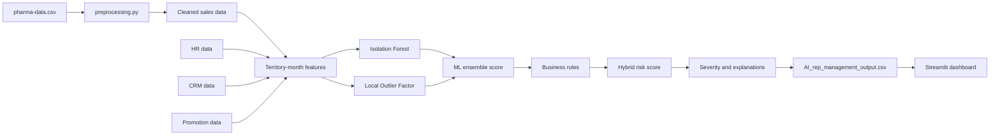
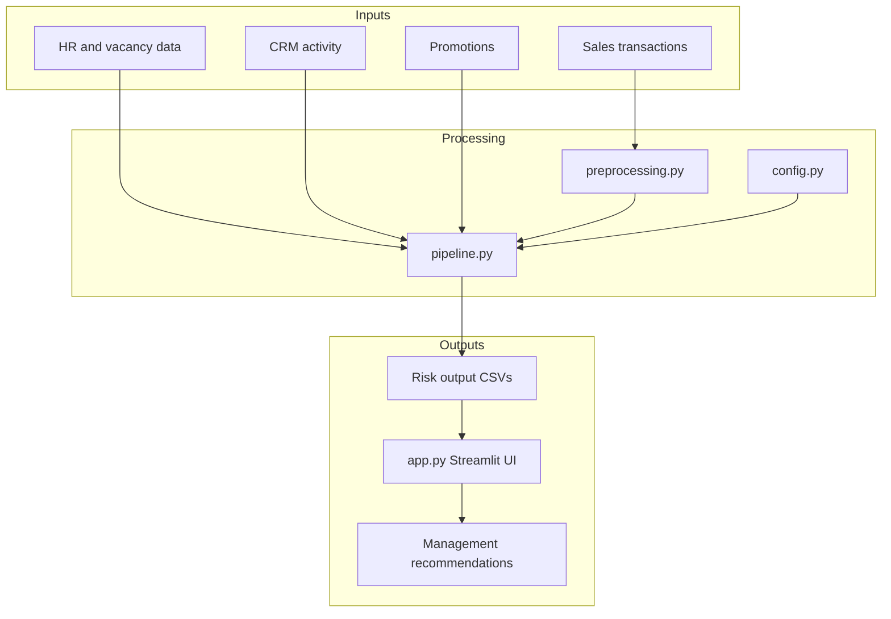
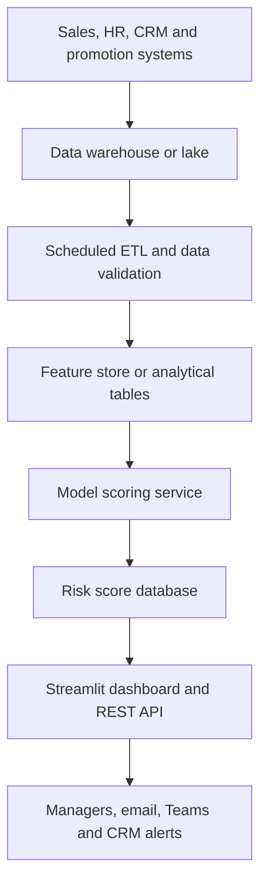
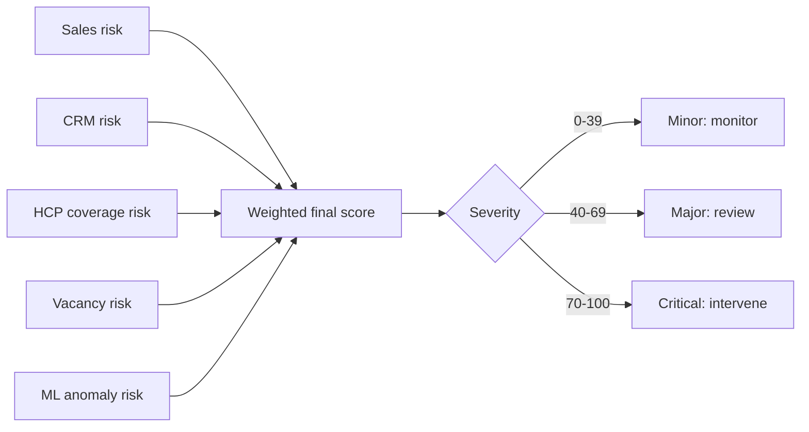
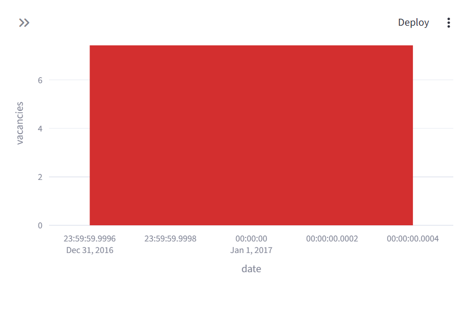
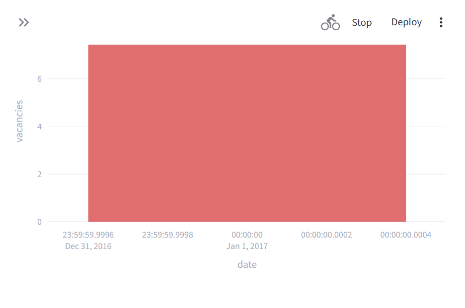
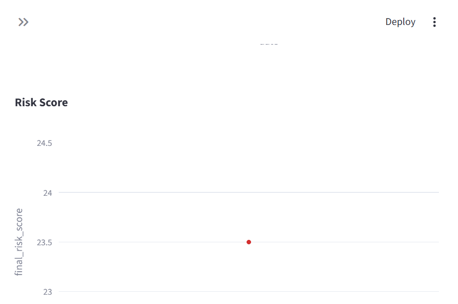
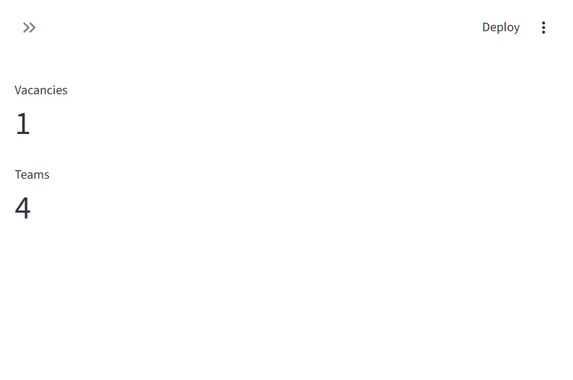
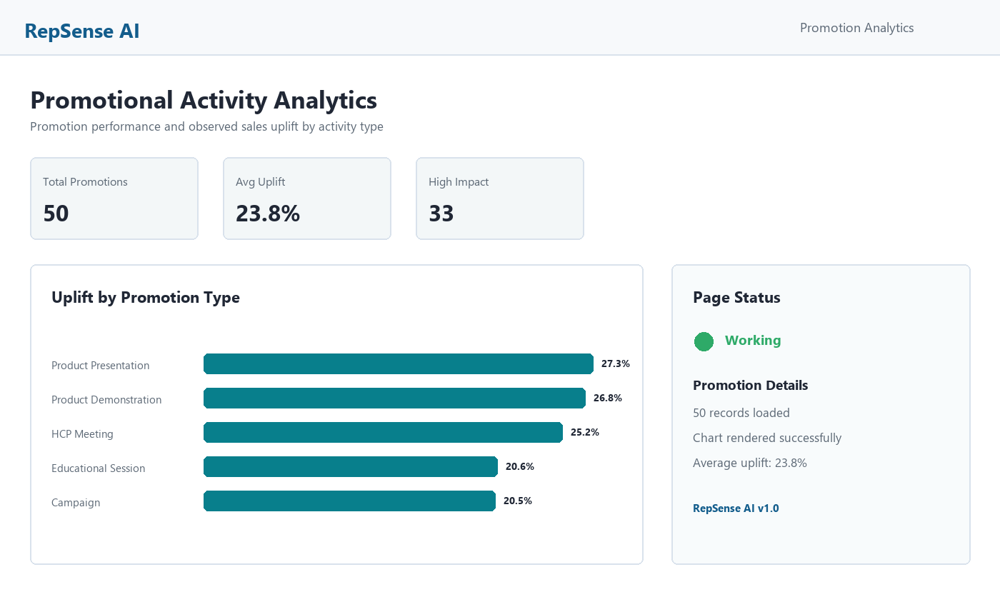
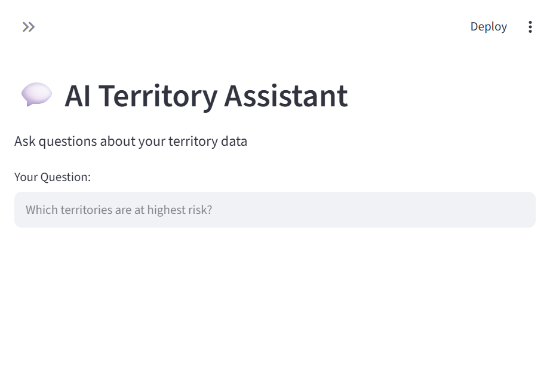

# RepSense AI – AI-Powered Sales Rep Vacancy Analysis & Rep Management Platform

## Overview

**RepSense AI** is an intelligent territory risk monitoring and sales rep management platform designed for pharmaceutical and sales organizations. It uses machine learning anomaly detection combined with business rules to identify territories and reps at risk, explains why they're flagged, and recommends actions.

### Business Problem Solved
The platform helps pharma/sales managers identify territories requiring management attention due to:
- Sales decline or sudden sales changes
- Sales rep vacancies or long vacancy durations
- Low CRM activity or poor HCP/customer coverage
- Rep workload imbalance
- Unusual territory performance (detected by ML)
- Promotional activity effectiveness

### Core Question Answered
For each territory-month:
1. **Where is there a problem?** → Territory_ID, specific metrics
2. **Why was it flagged?** → Risk_Reasons with detailed explanations
3. **How serious is it?** → Risk Score (0-100) and Severity (Critical/Major/Minor)
4. **What should management do?** → AI_Recommendation with actionable steps

---

## Architecture & Workflow

```
Raw Sales Data + Synthetic HR/CRM/Promo Data
    ↓
[Data Cleaning & Standardization]
    ↓
[Feature Engineering - Territory-Month Analytics]
    ↓ 
[Anomaly Detection (Isolation Forest + LOF)]
    ↓
[Business Rule Engine - Risk Thresholds]
    ↓
[Hybrid Risk Scoring]
    ↓
[Explainability Engine - Reasons & Recommendations]
    ↓
[Streamlit Dashboard & AI Assistant]
```

---

## Models & Methods

### 1. **Anomaly Detection - Ensemble Approach**

**Primary: Isolation Forest (60% weight)**
- Detects unusual combinations of features
- Unsupervised learning - no labeled data needed
- Fast and effective for multivariate outlier detection
- Configuration: contamination=0.05, random_state=42

**Secondary: Local Outlier Factor (40% weight)**
- Identifies points that are outliers relative to local neighborhood
- Useful for density-based anomalies
- Configuration: n_neighbors=20, contamination=0.05

**Ensemble Score:**
```
Ensemble_Anomaly_Score = (IF_Score × 0.60) + (LOF_Score × 0.40)
Score Range: 0-100 (higher = more anomalous)
```

### 2. **Business Rule Engine**

Hard-coded thresholds (configurable in config.py) for:

#### Sales Decline
- **Warning**: > -15% change
- **Major**: > -30% change  
- **Critical**: > -40% change

#### CRM Activity (%)
- **Warning**: < 80%
- **Major**: < 60%
- **Critical**: < 50%

#### HCP Coverage (%)
- **Warning**: < 85%
- **Major**: < 70%
- **Critical**: < 50%

#### Vacancy Status
- 1 vacancy = warning
- 2+ vacancies = major risk
- 30+ days open = warning
- 60+ days open = major risk
- 90+ days open = critical risk

### 3. **Hybrid Risk Scoring**

Combines ML and business rules:

```
Final_Risk_Score = (
    ML_Risk_Score × 0.35 +           # Anomaly detection
    Sales_Risk_Score × 0.25 +        # Sales decline
    CRM_Risk_Score × 0.15 +          # Activity
    HCP_Coverage_Risk × 0.10 +       # Coverage
    Vacancy_Risk_Score × 0.10 +      # Vacancies
    Long_Vacancy_Risk × 0.05         # Duration
)

Range: 0-100
Severity:
  70-100 = Critical
  40-70  = Major
  0-40   = Minor
```

---

## Dataset Explanation

### Main Source: pharma-data.csv (254,082 rows)
**Real pharmaceutical sales transaction data**
- Columns: Distributor, Customer, City, Country, Lat/Long, Channel, Sub-channel, Product, Class, Qty, Price, Sales, Month/Year, Sales Rep, Manager, Team
- Coverage: Multiple reps, territories, customers, products over time
- Data Quality: Cleaned for duplicates, negative transactions preserved and flagged

### Synthetic Data Layers (Reproducible - Seed=42)

#### 1. **rep_master_hr.csv** - Sales Rep Master Data
- 13 unique sales reps (from actual sales data)
- Fields: Rep_ID, Name, Manager, Sales Team, Primary Territory
- Status: Employment Status, Vacancy Flag, Vacancy Days (randomly assigned for demo)

#### 2. **crm_monthly_analysis.csv** - CRM Activity
- 12,480 monthly records (rep × territory × month)
- Fields: Date, Rep_ID, Territory, Planned Calls, Actual Calls, Planned Visits, Actual Visits
- Activity Metrics: Call Completion %, Visit Completion %, HCP Coverage %
- **Note**: Demo data with realistic activity patterns

#### 3. **promotional_activity.csv** - Promotions & Uplift
- 50+ promotional activities tied to actual reps, territories, products
- Fields: Date, Rep_ID, Territory, Product, Promotion Type, Sales Before/After, Uplift %
- Impact: Low/Medium/High classified by uplift percentage
- **IMPORTANT**: Uplift is CORRELATION not CAUSATION - language: "sales increased following the promotion" not "promotion caused sales increase"

#### 4. **territory_vacancy_analysis.csv** - Vacancy Tracking
- Territory-level vacancy summary by month
- Fields: Territory, Required Reps, Current Reps, Vacancies, Days Open

### Output Files

#### AI_rep_management_output.csv (Main Output)
**Current demo output: 8 territory-date records with complete risk analysis**
- Territory & date
- Sales metrics (Sales, Change %, Transactions, Customers)
- HR metrics (Reps, Vacancies, Vacancy Days)
- CRM metrics (Planned/Actual Calls/Visits, Activity %, Coverage %)
- Anomaly Scores: Isolation Forest, LOF, Ensemble
- Risk Scores: Sales Risk, CRM Risk, HCP Coverage Risk, Vacancy Risk, ML Risk, Business Risk, Final Risk
- Output: Severity (Critical/Major/Minor), Risk_Reasons (text), AI_Recommendation (text)

> The current demonstration run produces eight records because the available source data is reduced to one effective analysis date in the present processing path. A production run with a complete multi-month source would produce one record per territory and analysis period.

#### critical_territories.csv
Filtered view - only Critical severity territories for management focus

#### executive_dashboard.csv
Monthly aggregates - Total Sales, Territory Count, Average Risk, Total Vacancies, Critical Count

---

## Architecture Diagrams

### End-to-End Data and Risk Workflow



### Application Components



### Production Deployment Architecture



### Risk Scoring Flow



> GitHub and several Markdown viewers render Mermaid diagrams directly. If your PowerPoint workflow does not render Mermaid, use the diagram structure as a blueprint for SmartArt or export the diagrams from a Mermaid-compatible editor.

## Dashboard Screenshots

The following screenshots are captured from the working Streamlit application and are included in this repository.

## Hackathon Demonstration Video

[Download or open the RepSense AI hackathon demonstration video](RepSense_AI_Hackathon_Demo.mp4)

[Download the matching 10-slide PowerPoint presentation](RepSense_AI_Hackathon_Demo.pptx)

The approximately 44-second captioned walkthrough presents the input data, preprocessing, operational data layers, feature engineering, Isolation Forest, Local Outlier Factor, business rules, hybrid risk scoring, output file, and all six dashboard pages.

The PowerPoint follows the same story in 10 slides: title, input data, cleaning, operational context, features, ML detection, business rules, hybrid scoring, explainable output, and dashboard views.

### Executive Dashboard



Shows total sales, representatives, vacancies, critical territories, average risk, risk distribution, top-risk territories, and trends.

### AI Risk Monitor



Shows territory risk scores, sales change, vacancies, CRM activity, HCP coverage, severity, risk reasons, and recommendations.

### Territory Deep Dive



Shows detailed territory metrics, status, risk explanations, recommendations, and time-series charts.

### Rep Management



Shows the representative directory, employment status, active representatives, vacancies, and sales teams.

### Promotion Analytics



Shows promotion count, average uplift, high-impact promotions, uplift by promotion type, and promotion details.

### AI Assistant



Shows the keyword-based assistant for questions about high-risk territories, vacancies, sales declines, and CRM activity.

---

## Key Features

### 1. **Executive Dashboard**
- Sales trend over time
- Risk distribution (Critical/Major/Minor)
- Top 10 highest risk territories
- CRM activity trend
- HCP coverage trend
- Vacancy trend

### 2. **AI Risk Monitor**
- Interactive table of all territories with key metrics
- Sortable by any column
- Critical alerts with risk reasons and recommendations
- Major risk territory cards

### 3. **Territory Deep Dive**
- Select individual territory for detailed investigation
- Time-series charts: Sales, Risk Score, CRM Activity, HCP Coverage
- Current status with recommendation

### 4. **Rep Management**
- Sales rep directory with status
- Planned vs Actual calls by rep
- Performance metrics per rep

### 5. **Promotion Analytics**
- Promotional activity count and average uplift
- Uplift by promotion type
- Product effectiveness
- Activity details table

### 6. **AI Assistant**
- Natural language Q&A interface
- Handles common queries:
  - "Which territories are at highest risk?"
  - "Show vacancies"
  - "Which territories have falling sales?"
  - "Low CRM activity"
- Returns filtered results and charts

---

## How to Run

### 1. Install Dependencies
```bash
pip install -r requirements.txt
```

### 2. Prepare Data
```bash
# Generate/regenerate all synthetic data and risk scores
python pipeline.py

# This will create/update:
# - pharma_sales_cleaned.csv (cleaned sales data)
# - rep_master_hr.csv (HR data)
# - crm_activity_detail.csv (CRM activity detail)
# - crm_monthly_analysis.csv (monthly aggregated)
# - promotional_activity.csv (promotions)
# - AI_rep_management_output.csv (main output with risk scores)
# - executive_dashboard.csv (monthly summary)
# - critical_territories.csv (critical only)
```

### 3. Launch Streamlit Application
```bash
streamlit run app.py
```

App will open at: http://localhost:8501

---

## File Structure

```
project/
├── app.py                              # Streamlit application
├── pipeline.py                         # Complete data pipeline
├── preprocessing.py                    # Data cleaning utilities
├── config.py                          # Configuration & thresholds
├── requirements.txt                    # Python dependencies
├── README.md                          # This file
├── PRESENTATION_CONTENT.md             # Presentation-ready project content
├── KNOWLEDGE_BASE.html                 # Printable knowledge-base source
├── RepSense_AI_Knowledge_Base.pdf      # Knowledge-base PDF, when generated
├── SUBMISSION_DATA_README.md           # Hackathon sample-data guide
├── input/
│   └── pharma-data_sample.csv          # 1,000-row submission input sample
├── output/
│   ├── AI_rep_management_output_sample.csv
│   ├── rep_master_hr_sample.csv
│   ├── crm_activity_detail_sample.csv
│   ├── promotional_activity_sample.csv
│   ├── executive_dashboard_sample.csv
│   └── critical_territories_sample.csv
│
├── data/
│   ├── raw/
│   │   └── pharma-data.csv            # Original pharmaceutical sales data
│   └── processed/
│       ├── pharma_sales_cleaned.csv
│       ├── rep_master_hr.csv
│       ├── crm_activity_detail.csv
│       ├── crm_monthly_analysis.csv
│       ├── promotional_activity.csv
│       ├── AI_rep_management_output.csv (★ MAIN OUTPUT)
│       ├── executive_dashboard.csv
│       └── critical_territories.csv
│
└── tests/
    └── test_pipeline.py               # Basic pipeline tests
```

---

## Important Assumptions

1. **Synthetic Data**: The HR, CRM, and promotional layers are synthetic/demo data generated from the real sales dataset. In production, these should be integrated directly from enterprise HRM, CRM, and promotional systems.

2. **Fixed Random Seed**: All synthetic data is generated with seed=42 for reproducibility. Running `pipeline.py` multiple times will produce identical results.

3. **Territory Mapping**: Territories are derived deterministically from customer city locations. This is demo mapping and should be replaced with actual territory definitions.

4. **Anomaly Contamination Rate**: Set to 5% (configurable), meaning the models expect ~5% of records to be anomalous. Adjust in config.py based on your data.

5. **Thresholds Are Demo Values**: All business rule thresholds (sales decline %, CRM activity %, etc.) are realistic but demo values. They should be calibrated with your sales leadership.

6. **No Causality Claims**: Sales uplift following promotions is CORRELATION. We never claim causation without statistical evidence.

7. **Risk Scores Are Normalized**: Final risk score is 0-100 for easy interpretation. Severity is business rule-based.

---

## Technical Stack

| Component | Technology |
|-----------|-----------|
| **Data Processing** | Pandas, NumPy |
| **Machine Learning** | Scikit-learn (Isolation Forest, LOF) |
| **Visualization** | Streamlit, Plotly |
| **Language** | Python 3.8+ |
| **Data Format** | CSV (easily portable) |

---

## Methodology Notes

### Why Isolation Forest + LOF?

1. **Isolation Forest**:
   - Excellent for multivariate anomaly detection
   - Works with mixed data types
   - Computationally efficient
   - No assumptions about data distribution
   
2. **Local Outlier Factor**:
   - Complements IF by finding density-based anomalies
   - Good for detecting local context outliers
   - Useful when anomalies cluster differently by region
   
3. **Ensemble**:
   - Combines strengths: IF for global, LOF for local anomalies
   - More robust than single method
   - Weighted average allows fine-tuning sensitivity

### Why Business Rules + ML?

- **ML Alone**: May miss domain knowledge (e.g., 2+ vacancies is always risky)
- **Business Rules Alone**: Too rigid, can't detect novel patterns
- **Hybrid**: Best of both - explainable + adaptive

### Feature Engineering

Selected features are:
- **Predictive**: Capture territory health
- **Non-leaky**: Don't require future data
- **Interpretable**: Business can understand them
- **Robust**: Handle missing values

---

## Limitations & Future Work

### Current Limitations

1. **Monthly Aggregation**: Loses intra-month variation. Use detailed CRM activity data for finer analysis.
2. **No Forecasting**: Model explains current state, not predicts future. ARIMA/Prophet could extend this.
3. **No Geo-Spatial**: Doesn't consider geographic clustering of territories.
4. **Static Thresholds**: Thresholds don't adapt by territory type/region. Could use ML-learned thresholds.
5. **No External Factors**: Market events, competitor activity, economy not modeled.

### Production Readiness

For production deployment:

1. **Data Integration**: Replace CSV with real-time HRM, CRM, sales system APIs
2. **Model Retraining**: Retrain anomaly models weekly/monthly with new data
3. **Threshold Tuning**: Work with sales leadership to calibrate thresholds
4. **Explainability**: Add SHAP values for deeper ML explainability
5. **Performance**: Cache ML models, optimize queries for 10K+ territories
6. **Alerts**: Integrate with Slack/Teams for real-time critical alerts
7. **Audit Trail**: Log all risk scoring decisions for compliance
8. **A/B Testing**: Test different threshold sets to optimize outcomes

---

## Production Architecture Recommendation

```
Real-time Sales/HRM/CRM Systems
    ↓
[Data Warehouse / Data Lake]
    ↓
[ETL Pipeline - Daily batch]
    ↓
[Feature Store - Cached computed features]
    ↓
[ML Model Serving - Containerized pipeline.py]
    ↓
[Risk Score Database]
    ↓
[Streamlit Dashboard + REST API]
    ↓
[Users + Integrations (Slack, Email, CRM)]
```

---

## Support & Questions

For questions about:
- **Data**: Check `data/processed/` folder for all CSVs
- **Configuration**: Edit `config.py` to adjust thresholds and weights
- **Pipeline**: Review `pipeline.py` for complete workflow
- **App**: `app.py` contains all Streamlit logic

---

## License & Attribution

Built as an AI hackathon project demonstrating:
- ✓ Data engineering (cleaning, aggregation, synthetic data)
- ✓ Machine learning (ensemble anomaly detection)
- ✓ Business analytics (rule engine, risk scoring)
- ✓ Data visualization (Streamlit + Plotly)
- ✓ Software engineering (modular, configurable, well-documented)

**Disclaimer**: The prototype uses synthetic data layers. In production, replace with real enterprise data integrations.

---

**Last Updated**: 2026-09-01  
**Version**: 1.0 (Hackathon Prototype)
